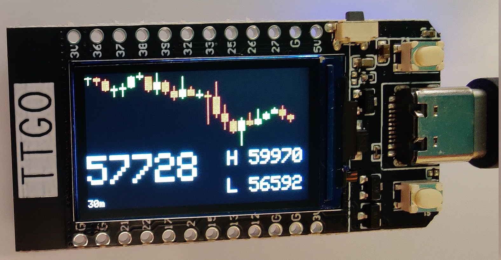
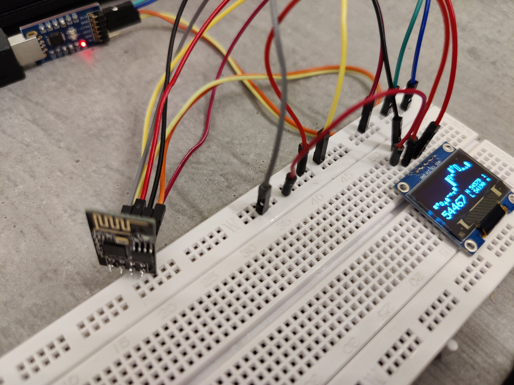

# Realtime Bitcoin Ticker




## Features
- Displays current price and candle chart in **realtime** using websockets
- Supported boards:
    - **ESP8266 ESP-01S WiFi Module** combined with a **SSD1306 OLED** display
    - **LILYGO TTGO T-Display ESP32**
- Based on PlatformIO for dependency management, compilation and flashing of binaries
- Arduino framework


## Hardware requirements
- ESP8266 ESP-01S WiFi Module combined with OLED Display SSD1306 128×64
- Programmer for the ESP8266 (I used a USB to Serial Converter)
- LILYGO TTGO T-Display ESP32 Development Board



## Usage

### Pin connections for ESP8266
ESP8266 programming mode


ESP <--> OLED connections


image sources:
 - https://www.instructables.com/ESP-01-Module-Programming-Board/
 - https://pdacontrolen.com/esp8266-display-oled-i2c-client-irc/
### Compilation and Flashing

Make sure PlatformIO is installed (see also the [PlatformIO documentation](https://docs.platformio.org/en/latest/core/installation.html)):
```bash
$ pip install -U platformio
```
Set the WiFi parameters in `config.h`, then choose an environment <env> from:
```bash
$ pio project config
```
Compile the project and create the firmware for a specific environment:
```bash
$ pio run -e <env>
```

#### ESP8266
Put the ESP8266 in programming mode and flash the device:
```bash
$ pio run -e esp01_1m -t upload
```

#### TTGO
Connect the board and flash the firmware:
```bash
$ pio run -e ttgo -t upload
```

#### Debugging
For verbose serial output choose the respective debug environments:
```bash
$ pio run -e <env>:debug -t upload
```

## License
<p xmlns:dct="http://purl.org/dc/terms/" xmlns:vcard="http://www.w3.org/2001/vcard-rdf/3.0#">
  <a rel="license"
     href="http://creativecommons.org/publicdomain/zero/1.0/">
    
  </a>
  <br />
  To the extent possible under law,
  <span resource="[_:publisher]" rel="dct:publisher">
    <span property="dct:title">Jan Sturm</span></span>
  has waived all copyright and related or neighboring rights to
  <span property="dct:title">BTC ticker</span>.
This work is published from:
<span property="vcard:Country" datatype="dct:ISO3166"
      content="DE" about="[_:publisher]">
  Germany</span>.
</p>
